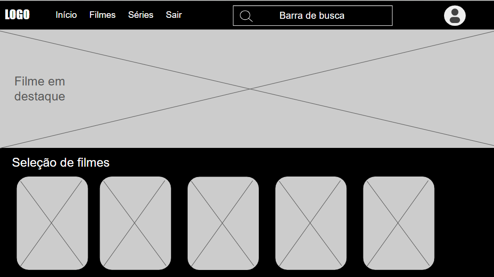
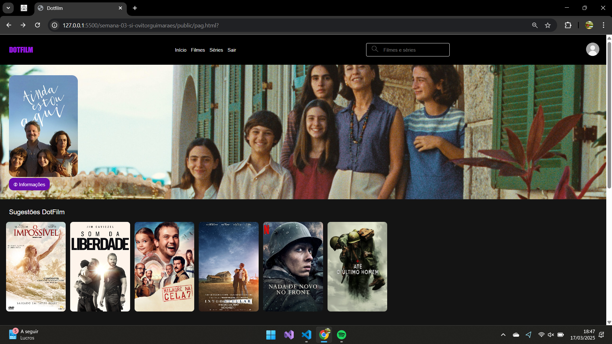

# Trabalho Prático - Semana 03

Dessa vez, vamos escolher uma proposta de projeto para trabalhar. Na [lista de propostas de projetos](propostas-projetos.md), escolha um dentre as alternativas.

Nessa atividade, você deverá montar a página inicial do projeto escolhido, a organização do HTML aplicando semântica correta e uso aprimorado do CSS. Leia o enunciado completo no Canvas para mais detalhes.

**IMPORTANTE:** Você deve trabalhar e alterar apenas arquivos dentro da pasta **`public`**. Deixe todos os demais arquivos e pastas desse repositório inalterados. **PRESTE MUITA ATENÇÃO NISSO.**

## Informações Gerais

- Nome: Vitor de Oliveira Guimarães
- Matricula: 895045
- Proposta de projeto escolhida: Catálogo de Filmes
- Breve descrição sobre seu projeto: O DotFilm é um projeto web focado em ser um catálogo de filmes, o nome veio da ideia de que o site é um ponto de informações sobre títulos cinematográficos. Até o momento, o site possui uma tela de login e uma página inicial. A meta é criar um site simples e funcional onde o usuário pode navegar por uma lista de filmes e acessar informações básicas sobre cada um deles.

## Print do esboço criada

## Print da home-page criada

